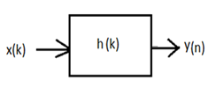

## Theory

 
Convolution is a fundamental constituent of digital signal processing. When an input signal 
                                sequence x(k)
                                passes through a filter whose impulse response is h(k) as shown in the figure below, the output of the filter be denoted as y(k),
                                then mathematically, 

                            
y(n)=h(k)*x(k)

                            
where '*' symbol means convolution.
                            

                            
Let's say that the input sequence x(k) has length Q in time domain, the impulse response h(k) has 
                                length P in time-domain, then mathematically,
`y(x)=sum_(k=0)^(P+Q-2)h(k)x(n-k)`

                            
Thus the length of the output sequence y(n) will be (P+Q-1)

                            
Thus performing convolution involves the following steps:

                            
1.Plotting both h(k) and x(k).

                            
2.Flipping the x(k) sequence about the k = 0 value to get x(-k).

                            
3.Summing the products of h(k) and x(0-k) for all k, to obtain y(0).

                            
4.Shifting x(-k) one sample to the right.

                            
5.Summing the products of h(k) and x(1-k) for all k to obtian y(1).

                            
6.Repeat steps (5) & (6) i.e. shifting and summing products until there's no overlap of h(k) and 
                                the shifted x(n-k), in which case all further y(n)'s are zero.

                            
Let the input sequence x(k) passes through two filters with impulse response h1(k) and h2(k), and 
                                the output sequence after the signal passes through the first and the second filter be denoted as
                                y1(n) and y2(n), then we have the following relations

                            
`y(x)=sum_(k=0)^(P+Q-2)h(k)x(n-k)`

                            
`y1(n)=h1(k)**x(k)`

                            
`y2(n)=h2(k)**y1(k)`

                            
`=h2(k)**(h1(k)**x(k))`

                            
For a linear time-invariant system, we thus have,

                            
`y2(n) = (h1(k) **h2(k)) **x(k)`

                            
`= h(k) ** x(k)`

                            
Thus the effective transfer function of the two filter blocks in series is given by,

                            
`h(k) = h1(k) ** h2(k)`

                            
Let the input sequence x(k) passes through two filters in parallel with impulse response h1(k) 
                                and h2(k), and the output sequence after the signal passes through the first and the second filter be denoted as 
                                y1(n) and y2(n) as shown in the figure below.

                            
We thus have the following relations,

                            
`y1(n) = h1(k) **x(k)`

                            
`y2(n) = h2(k)**x(k)`

                            
The combined output is thus given by,

                            
`y(n) = y1(n) + y2(n)`

                            
`= h1(k) ** x(k) + h2(k)**x(k)`

                            
`=(h1(k) + h2(k)) ** x(k))`

                           
Thus the effective transfer function of the two filter blocks in parallel is given by

                           
`h(k) = h1(k) + h2(k)`
                           

     
 